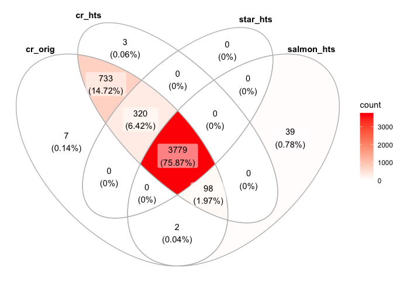
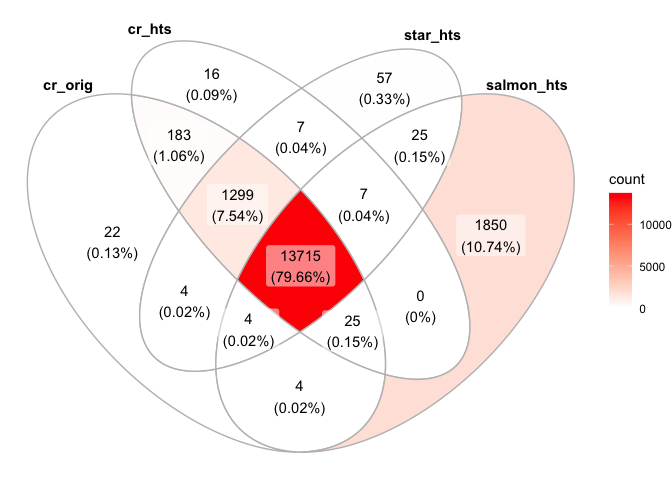
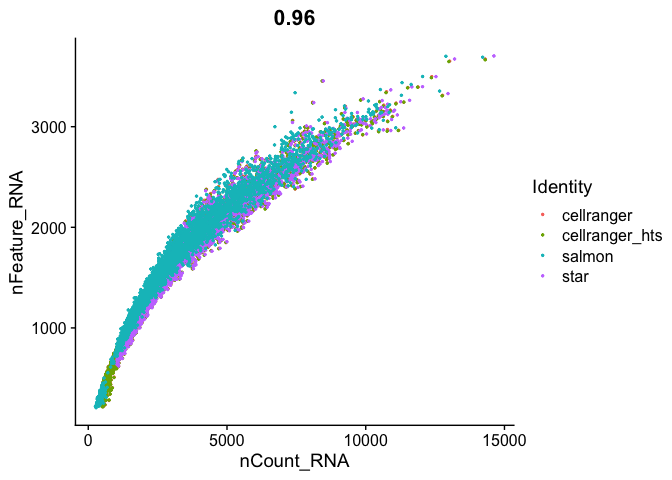
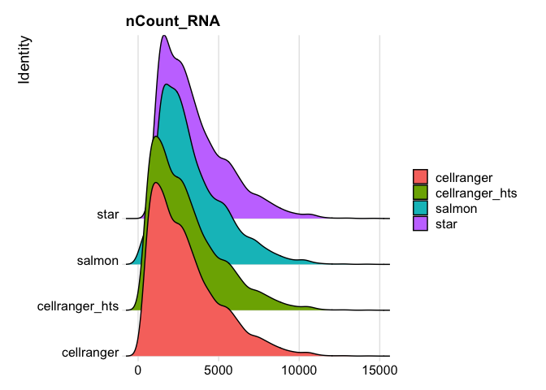
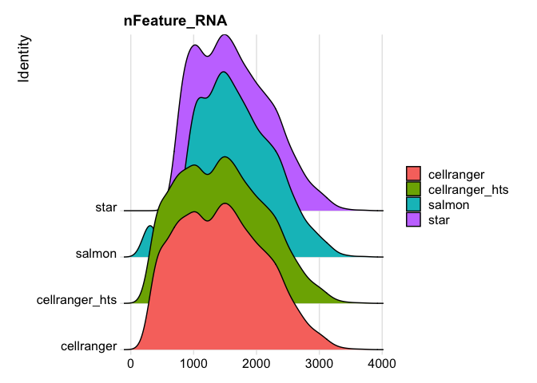
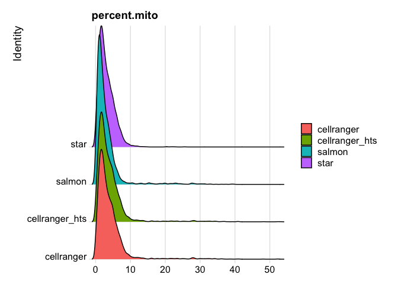
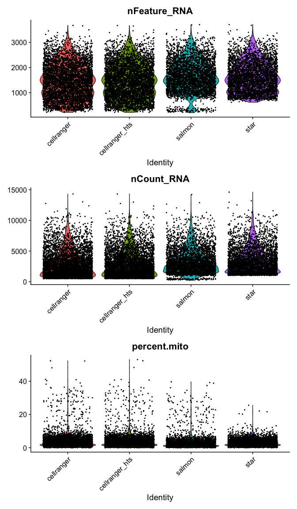
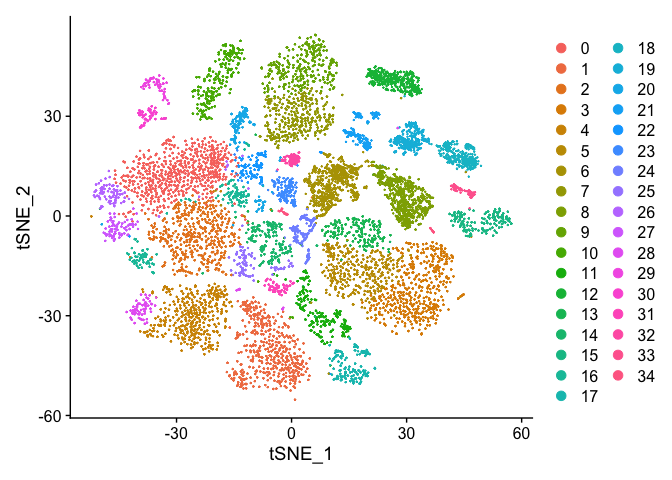
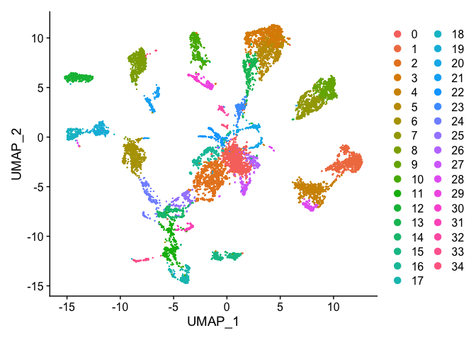
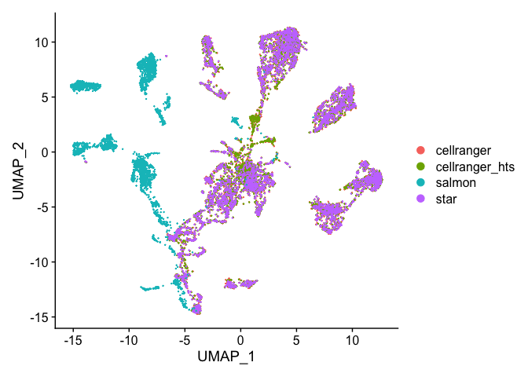

# Single Cell Analysis with Seurat and some custom code!

[Seurat](http://satijalab.org/seurat/) is a popular R package that is designed for QC, analysis, and exploration of single cell data. Seurat aims to enable users to identify and interpret sources of heterogeneity from single cell transcriptomic measurements, and to integrate diverse types of single cell data. Further, the authors provide several [tutorials](https://satijalab.org/seurat/vignettes.html) on their website.

We start with loading needed libraries for R

```r
library(Seurat)
library(tximport)
library(ggVennDiagram)
```

## Load the Expression Matrix Data and create the combined base Seurat object.

Seurat provides a function `Read10X` to read in 10X data folder. First we read in data from each individual sample folder. Then, we initialize the Seurat object (`CreateSeuratObject`) with the raw (non-normalized data). Keep all genes expressed in >= 3 cells. Keep all cells with at least 200 detected genes. Also extracting sample names, calculating and adding in the metadata mitochondrial percentage of each cell. Some QA/QC Finally, saving the raw Seurat object.

### A ens2sym.txt file

Reading in the salmon file, we will need to convert the ensembl ids to gene symbols. just like we did [here]  (https://ucdavis-bioinformatics-training.github.io/2020-August-Advanced-scRNAseq/data_reduction/scMapping) to create the txp2gene.txt file from biomart, we will want to do the same for the ens2sym.txt file. You will need 3 columns "Gene stable ID", "Gene stable ID version", and "Gene name". Your final file should look like this

```
Gene stable ID	Gene stable ID version	Gene name
ENSMUSG00000064372	ENSMUSG00000064372.1	mt-Tp
ENSMUSG00000064371	ENSMUSG00000064371.1	mt-Tt
ENSMUSG00000064370	ENSMUSG00000064370.1	mt-Cytb
ENSMUSG00000064369	ENSMUSG00000064369.1	mt-Te
ENSMUSG00000064368	ENSMUSG00000064368.1	mt-Nd6
ENSMUSG00000064367	ENSMUSG00000064367.1	mt-Nd5
ENSMUSG00000064366	ENSMUSG00000064366.1	mt-Tl2
ENSMUSG00000064365	ENSMUSG00000064365.1	mt-Ts2
ENSMUSG00000064364	ENSMUSG00000064364.1	mt-Th
ENSMUSG00000064363	ENSMUSG00000064363.1	mt-Nd4
ENSMUSG00000065947	ENSMUSG00000065947.3	mt-Nd4l
ENSMUSG00000064361	ENSMUSG00000064361.1	mt-Tr
ENSMUSG00000064360	ENSMUSG00000064360.1	mt-Nd3
```


```r
## Cellranger
cellranger_orig <- Read10X_h5("Adv_comparison_outputs/654/outs/filtered_feature_bc_matrix.h5")
# If hdf5 isn't working read in from the mtx files
#cellranger_orig <- Read10X("Adv_comparison_outputs/654/outs/filtered_feature_bc_matrix")
s_cellranger_orig <- CreateSeuratObject(counts = cellranger_orig, min.cells = 3, min.features = 200, project = "cellranger")
s_cellranger_orig
```

```
## An object of class Seurat 
## 15256 features across 4939 samples within 1 assay 
## Active assay: RNA (15256 features, 0 variable features)
```

```r
cellranger_htstream <- Read10X_h5("Adv_comparison_outputs/654_htstream/outs/filtered_feature_bc_matrix.h5")
s_cellranger_hts <- CreateSeuratObject(counts = cellranger_htstream, min.cells = 3, min.features = 200, project = "cellranger_hts")
s_cellranger_hts
```

```
## An object of class Seurat 
## 15252 features across 4933 samples within 1 assay 
## Active assay: RNA (15252 features, 0 variable features)
```

```r
## STAR
star <- Read10X("Adv_comparison_outputs/654_htstream_star/outs/filtered_feature_bc_matrix" )
s_star_hts <- CreateSeuratObject(counts = star, min.cells = 3, min.features = 200, project = "star")
s_star_hts
```

```
## An object of class Seurat 
## 15118 features across 4099 samples within 1 assay 
## Active assay: RNA (15118 features, 0 variable features)
```

```r
## SALMON
txi <- tximport("Adv_comparison_outputs/654_htstream_salmon_decoys/alevin/quants_mat.gz", type="alevin")
```

```
## importing alevin data is much faster after installing `fishpond` (>= 1.2.0)
```

```
## reading in alevin gene-level counts across cells
```

```r
## salmon is in ensembl IDs, need to convert to gene symbol
head(rownames(txi$counts))
```

```
## [1] "ENSMUSG00000064370.1" "ENSMUSG00000064368.1" "ENSMUSG00000064367.1"
## [4] "ENSMUSG00000064363.1" "ENSMUSG00000065947.3" "ENSMUSG00000064360.1"
```

```r
ens2symbol <- read.table("ens2sym.txt",sep="\t",header=T,as.is=T)
map <- ens2symbol$Gene.name[match(rownames(txi$counts),ens2symbol$Gene.stable.ID.version)]

txi_counts <- txi$counts[-which(duplicated(map)),]
map <- map[-which(duplicated(map))]
rownames(txi_counts) <- map
dim(txi_counts)
```

```
## [1] 35805  3919
```

```r
s_salmon_hts <- CreateSeuratObject(counts = txi_counts , min.cells = 3, min.features = 200, project = "salmon")
s_salmon_hts
```

```
## An object of class Seurat 
## 15630 features across 3918 samples within 1 assay 
## Active assay: RNA (15630 features, 0 variable features)
```

```r
# Need to Check Rows names/Col names before merge 

# they however have different looking cell ids, need to fix
head(colnames(s_cellranger_orig))
```

```
## [1] "AAACCTGAGATCACGG-1" "AAACCTGAGCATCATC-1" "AAACCTGAGCGCTCCA-1"
## [4] "AAACCTGAGTGGGATC-1" "AAACCTGCAGACAGGT-1" "AAACCTGCATCATCCC-1"
```

```r
head(colnames(s_star_hts))
```

```
## [1] "AAACCTGAGATCACGG" "AAACCTGAGCATCATC" "AAACCTGAGCGCTCCA" "AAACCTGAGTGGGATC"
## [5] "AAACCTGCAGACAGGT" "AAACCTGGTATAGGTA"
```

```r
head(colnames(s_salmon_hts))
```

```
## [1] "TGGGAAGCACTACAGT" "CACATAGAGACTAGGC" "GTTTCTAGTTCCACAA" "TACTCATCATAGGATA"
## [5] "CACAGGCCAATCTGCA" "GTAGGCCAGGACAGCT"
```

```r
s_cellranger_orig <- RenameCells(s_cellranger_orig, new.names = sapply(X = strsplit(colnames(s_cellranger_orig), split = "-"), FUN = "[", 1))

s_cellranger_hts <- RenameCells(s_cellranger_hts, new.names = sapply(X = strsplit(colnames(s_cellranger_hts), split = "-"), FUN = "[", 1))


## Merge the dataset
s_merged <- merge(s_cellranger_orig, y = c(s_cellranger_hts, s_star_hts, s_salmon_hts), add.cell.ids = c("cr.orig", "cr.hts", "star.hts", "salmon.hts"), project = "MapTest")
s_merged
```

```
## An object of class Seurat 
## 17218 features across 17889 samples within 1 assay 
## Active assay: RNA (17218 features, 0 variable features)
```

```r
head(colnames(s_merged))
```

```
## [1] "cr.orig_AAACCTGAGATCACGG" "cr.orig_AAACCTGAGCATCATC"
## [3] "cr.orig_AAACCTGAGCGCTCCA" "cr.orig_AAACCTGAGTGGGATC"
## [5] "cr.orig_AAACCTGCAGACAGGT" "cr.orig_AAACCTGCATCATCCC"
```

```r
tail(colnames(s_merged))
```

```
## [1] "salmon.hts_AAAGTAGGTACGAAAT" "salmon.hts_GTGCATAGTAAACACA"
## [3] "salmon.hts_CGATGGCCAGGTCTCG" "salmon.hts_ATCCGAAGTGCTGTAT"
## [5] "salmon.hts_ACACTGATCGCCCTTA" "salmon.hts_ACACCAAGTGTGACCC"
```

```r
table(s_merged$orig.ident)
```

```
## 
##     cellranger cellranger_hts         salmon           star 
##           4939           4933           3918           4099
```

```r
table(table(sapply(X = strsplit(colnames(s_merged), split = "_"), FUN = "[", 2)))
```

```
## 
##    1    2    3    4 
##   49  735  418 3779
```

### The percentage of reads that map to the mitochondrial genome

* Low-quality / dying cells often exhibit extensive mitochondrial content
* We calculate mitochondrial QC metrics with the PercentageFeatureSet function, which calculates the percentage of counts originating from a set of features.
* We use the set of all genes, in mouse these genes can be identified as those that begin with 'mt', in human data they begin with MT.


```r
s_merged$percent.mito <- PercentageFeatureSet(s_merged, pattern = "^mt-")
```

### Lets spend a little time getting to know the Seurat object.

The Seurat object is the center of each single cell analysis. It stores __all__ information associated with the dataset, including data, annotations, analyses, etc. The R function slotNames can be used to view the slot names within an object.


```r
slotNames(s_merged)
```

```
##  [1] "assays"       "meta.data"    "active.assay" "active.ident" "graphs"      
##  [6] "neighbors"    "reductions"   "images"       "project.name" "misc"        
## [11] "version"      "commands"     "tools"
```


```r
head(s_merged[[]])
```

```
##                          orig.ident nCount_RNA nFeature_RNA percent.mito
## cr.orig_AAACCTGAGATCACGG cellranger       2501         1354    7.3570572
## cr.orig_AAACCTGAGCATCATC cellranger       2703         1353    0.8139105
## cr.orig_AAACCTGAGCGCTCCA cellranger       2912         1550    3.7087912
## cr.orig_AAACCTGAGTGGGATC cellranger       3735         1954    0.5622490
## cr.orig_AAACCTGCAGACAGGT cellranger       1123          809    1.2466607
## cr.orig_AAACCTGCATCATCCC cellranger        535          428    5.7943925
```

```r
head(s_merged@meta.data)
```

```
##                          orig.ident nCount_RNA nFeature_RNA percent.mito
## cr.orig_AAACCTGAGATCACGG cellranger       2501         1354    7.3570572
## cr.orig_AAACCTGAGCATCATC cellranger       2703         1353    0.8139105
## cr.orig_AAACCTGAGCGCTCCA cellranger       2912         1550    3.7087912
## cr.orig_AAACCTGAGTGGGATC cellranger       3735         1954    0.5622490
## cr.orig_AAACCTGCAGACAGGT cellranger       1123          809    1.2466607
## cr.orig_AAACCTGCATCATCCC cellranger        535          428    5.7943925
```

#### Question(s)

1. What slots are empty, what slots have data?
2. What columns are available in meta.data?
3. Look up the help documentation for subset?


## Now lets do some basic comparisons. Do they share the same cellbarcodes?

```r
ggVennDiagram(list("cr_orig"=colnames(s_cellranger_orig),"cr_hts"=colnames(s_cellranger_hts), "star_hts"=colnames(s_star_hts), "salmon_hts"=colnames(s_salmon_hts)))
```

<!-- -->

```r
cr_orig_genes <- rowSums(as.matrix(GetAssayData(subset(s_merged, cells=colnames(s_merged)[s_merged$orig.ident=="cellranger"]))))
cr_hts_genes <- rowSums(as.matrix(GetAssayData(subset(s_merged, cells=colnames(s_merged)[s_merged$orig.ident=="cellranger_hts"]))))
star_hts_genes <- rowSums(as.matrix(GetAssayData(subset(s_merged, cells=colnames(s_merged)[s_merged$orig.ident=="star"]))))
salmon_hts_genes <- rowSums(as.matrix(GetAssayData(subset(s_merged, cells=colnames(s_merged)[s_merged$orig.ident=="salmon"]))))

minReads=0
ggVennDiagram(list("cr_orig"=names(cr_orig_genes[cr_orig_genes>minReads]),"cr_hts"=names(cr_hts_genes[cr_hts_genes>minReads]), "star_hts"=names(star_hts_genes[star_hts_genes>minReads]), "salmon_hts"=names(salmon_hts_genes[salmon_hts_genes>minReads])))
```

<!-- -->

```r
FeatureScatter(
  s_merged, "nCount_RNA", "nFeature_RNA",
  pt.size = 0.5)
```

<!-- -->

#### Question(s)

1. Spend a minute playing with minReads, see how the data changes.
2. What are the sum of UMIs for each?
3. Look up the help documentation for subset?


### Lets take a look at some other metadata


```r
RidgePlot(s_merged, features="nCount_RNA")
```

```
## Picking joint bandwidth of 338
```

<!-- -->

```r
RidgePlot(s_merged, features="nFeature_RNA")
```

```
## Picking joint bandwidth of 106
```

<!-- -->

```r
RidgePlot(s_merged, features="percent.mito")
```

```
## Picking joint bandwidth of 0.367
```

<!-- -->


```r
VlnPlot(
  s_merged,
  features = c("nFeature_RNA", "nCount_RNA","percent.mito"),
  ncol = 1, pt.size = 0.3)
```

<!-- -->


```r
s_merged <- NormalizeData(s_merged, normalization.method = "LogNormalize", scale.factor = 10000)
s_merged <- FindVariableFeatures(s_merged, selection.method = "vst", nfeatures = 2000)

all.genes <- rownames(s_merged)
s_merged <- ScaleData(s_merged, features = all.genes)
```

```
## Centering and scaling data matrix
```

```r
s_merged <- RunPCA(s_merged, features = VariableFeatures(object = s_merged))
```

```
## PC_ 1 
## Positive:  Sncg, Ubb, Txn1, Fxyd2, Atp6v0b, Lxn, Sh3bgrl3, Rabac1, Dctn3, Pfn1 
## 	   Ppia, Fez1, Ndufa11, Cisd1, Ndufa4, Atp6v1f, Atpif1, S100a10, Psmb2, Psmb6 
## 	   S100a6, Tmem45b, Prdx2, Elob, Nme1, Cox6a1, Gabarapl2, Bex2, Pop5, Bex3 
## Negative:  Adcyap1, Celf4, Gap43, Kit, Atp2b4, Ngfr, Gal, Fxyd7, Lynx1, Spock1 
## 	   Enah, Meg3, Pcp4, Mt1, Nptn, Eno2, 6330403K07Rik, Syt2, Map2, Unc80 
## 	   Gpx3, Sv2b, S1pr3, Fgf1, Ptn, Cntn1, Dbpht2, Malat1, S100b, Faim2 
## PC_ 2 
## Positive:  Cntn1, S100b, Nefh, Thy1, Cplx1, Tagln3, Sv2b, Hopx, Slc17a7, Ntrk3 
## 	   Lrrn1, Nefm, Atp1b1, Vsnl1, Atp2b2, Nefl, Nat8l, Chchd10, Scn8a, Vamp1 
## 	   Scn1a, Scn1b, Syt2, Mcam, Endod1, Kcna2, Lynx1, Sh3gl2, Scn4b, Cpne6 
## Negative:  Cd24a, Malat1, Dusp26, Tmem233, Mal2, Prkca, Cd9, Osmr, Tmem158, Nppb 
## 	   Ift122, Cd44, Carhsp1, Calca, Sst, Tac1, Arpc1b, Npy2r, Gadd45g, Gm525 
## 	   Gna14, Adcyap1, Bhlhe41, Cd82, Atpaf2, Gpx3, Adk, Scg2, Sntb1, Nts 
## PC_ 3 
## Positive:  Gm10925, Gm28661, Rps7-ps3, Rpl10-ps3, Gm28437, Gm21981, Gm45234, Rpl9-ps6, Gm20390, Gm21988 
## 	   Rps27rt, Rpl27-ps3, Gm45713, Gm10177, Gm10288, Gm10175, Kxd1, Rnasek, Gm8430, Rpl10a-ps1 
## 	   Atp5o, Rpl17-ps3, Nme2, Rps6-ps4, Uba52, Gm12918, Gstp2, Gm14586, Rpl23a-ps3, Rps13-ps2 
## Negative:  Malat1, Aldoa, Meg3, Atp5o.1, D130009I18Rik, D130079A08Rik, AC160336.1, Atpaf2, Gm2694, Nol4l 
## 	   B230312C02Rik, Ctsl, Ndufb4, Prxl2c, Nip7, Gpx4, Grik1, Synpr, Sult5a1, Tmem245 
## 	   D930028M14Rik, Gfra2, Gm34455, Zfp202, Ubash3a, Ppp1r1a, Scg3, Mgst3, Gm567, Tubb4b 
## PC_ 4 
## Positive:  Tspan8, Etv1, Jak1, Tmem233, Resp18, Adk, Nppb, Skp1a, Scg2, Sst 
## 	   Cystm1, Osmr, Gm525, Nts, Ift122, Nefh, Npy2r, Map7d2, Tesc, Prkca 
## 	   Nsg1, S100b, Cd82, Calm1, Blvrb, Thy1, Htr1f, Ddah1, Crip2, Carhsp1 
## Negative:  Gm7271, Tafa4, P2ry1, Rarres1, Th, Fxyd6, Wfdc2, Id4, Zfp521, Iqsec2 
## 	   Gfra2, Rgs5, Tox3, Cdkn1a, Kcnd3, Rgs10, Alcam, Rasgrp1, Rprm, Pou4f2 
## 	   C1ql4, Piezo2, D130079A08Rik, Synpr, Spink2, Ceacam10, Camk2n1, Bok, Ptpre, Cd81 
## PC_ 5 
## Positive:  Basp1, Gm765, Cd44, Prkar2b, Calcb, Rab27b, Lpar3, Ctxn3, Calca, Ly86 
## 	   Mt3, Nefl, Aplp2, Rgs7, Mrgprd, Anks1b, Nrn1l, Nrn1, Gap43, Cd55 
## 	   Grik1, Tmem255a, Serping1, Rspo2, Klhl5, Nmb, S100a7l2, Synpr, Ptprt, Otoa 
## Negative:  Nppb, Sst, Gm525, Nts, Osmr, Jak1, Htr1f, Npy2r, Hpcal1, Cysltr2 
## 	   Ptprk, Tesc, Tspan8, Il31ra, Resp18, Blvrb, Etv1, Cmtm7, Cavin1, Ada 
## 	   Fam178b, Gstt2, Pde4c, Nbl1, Sntb1, Ddah1, Nsg1, Camk2n1, Ptafr, Lgals1
```

```r
use.pcs = 1:30
s_merged <- FindNeighbors(s_merged, dims = use.pcs)
```

```
## Computing nearest neighbor graph
```

```
## Computing SNN
```

```r
s_merged <- FindClusters(s_merged, resolution = c(0.5,0.75,1.0))
```

```
## Modularity Optimizer version 1.3.0 by Ludo Waltman and Nees Jan van Eck
## 
## Number of nodes: 17889
## Number of edges: 786490
## 
## Running Louvain algorithm...
## Maximum modularity in 10 random starts: 0.9490
## Number of communities: 28
## Elapsed time: 2 seconds
## Modularity Optimizer version 1.3.0 by Ludo Waltman and Nees Jan van Eck
## 
## Number of nodes: 17889
## Number of edges: 786490
## 
## Running Louvain algorithm...
## Maximum modularity in 10 random starts: 0.9340
## Number of communities: 30
## Elapsed time: 2 seconds
## Modularity Optimizer version 1.3.0 by Ludo Waltman and Nees Jan van Eck
## 
## Number of nodes: 17889
## Number of edges: 786490
## 
## Running Louvain algorithm...
## Maximum modularity in 10 random starts: 0.9199
## Number of communities: 35
## Elapsed time: 2 seconds
```

```r
s_merged <- RunTSNE(s_merged, dims = use.pcs, check_duplicates = FALSE)
s_merged <- RunUMAP(s_merged, dims = use.pcs)
```

```
## Warning: The default method for RunUMAP has changed from calling Python UMAP via reticulate to the R-native UWOT using the cosine metric
## To use Python UMAP via reticulate, set umap.method to 'umap-learn' and metric to 'correlation'
## This message will be shown once per session
```

```
## 07:48:15 UMAP embedding parameters a = 0.9922 b = 1.112
```

```
## 07:48:15 Read 17889 rows and found 30 numeric columns
```

```
## 07:48:15 Using Annoy for neighbor search, n_neighbors = 30
```

```
## 07:48:15 Building Annoy index with metric = cosine, n_trees = 50
```

```
## 0%   10   20   30   40   50   60   70   80   90   100%
```

```
## [----|----|----|----|----|----|----|----|----|----|
```

```
## **************************************************|
## 07:48:17 Writing NN index file to temp file /var/folders/74/h45z17f14l9g34tmffgq9nkw0000gn/T//RtmpYUy6Kh/file25b213101b51
## 07:48:17 Searching Annoy index using 1 thread, search_k = 3000
## 07:48:22 Annoy recall = 100%
## 07:48:22 Commencing smooth kNN distance calibration using 1 thread
## 07:48:23 Initializing from normalized Laplacian + noise
## 07:48:24 Commencing optimization for 200 epochs, with 777262 positive edges
## 07:48:32 Optimization finished
```

```r
DimPlot(s_merged, reduction = "tsne")
```

<!-- -->

```r
DimPlot(s_merged, reduction = "umap")
```

<!-- -->

```r
DimPlot(s_merged, group.by = "orig.ident", reduction = "umap")
```

<!-- -->

## Finally, save the original object, write out a tab-delimited table that could be read into excel, and view the object.

```r
## Original dataset in Seurat class, with no filtering
save(s_merged,file="mapping_comparison_object.RData")
```

## Session Information

```r
sessionInfo()
```

```
## R version 4.0.2 (2020-06-22)
## Platform: x86_64-apple-darwin17.0 (64-bit)
## Running under: macOS Catalina 10.15.5
## 
## Matrix products: default
## BLAS:   /Library/Frameworks/R.framework/Versions/4.0/Resources/lib/libRblas.dylib
## LAPACK: /Library/Frameworks/R.framework/Versions/4.0/Resources/lib/libRlapack.dylib
## 
## locale:
## [1] en_US.UTF-8/en_US.UTF-8/en_US.UTF-8/C/en_US.UTF-8/en_US.UTF-8
## 
## attached base packages:
## [1] stats     graphics  grDevices datasets  utils     methods   base     
## 
## other attached packages:
## [1] ggVennDiagram_0.3 tximport_1.16.1   Seurat_3.2.0     
## 
## loaded via a namespace (and not attached):
##   [1] Rtsne_0.15            colorspace_1.4-1      deldir_0.1-28        
##   [4] ellipsis_0.3.1        class_7.3-17          ggridges_0.5.2       
##   [7] futile.logger_1.4.3   spatstat.data_1.4-3   farver_2.0.3         
##  [10] leiden_0.3.3          listenv_0.8.0         ggrepel_0.8.2        
##  [13] bit64_4.0.2           RSpectra_0.16-0       codetools_0.2-16     
##  [16] splines_4.0.2         knitr_1.29            polyclip_1.10-0      
##  [19] jsonlite_1.7.0        ica_1.0-2             cluster_2.1.0        
##  [22] png_0.1-7             uwot_0.1.8            shiny_1.5.0          
##  [25] sctransform_0.2.1     compiler_4.0.2        httr_1.4.2           
##  [28] Matrix_1.2-18         fastmap_1.0.1         lazyeval_0.2.2       
##  [31] later_1.1.0.1         formatR_1.7           htmltools_0.5.0      
##  [34] tools_4.0.2           rsvd_1.0.3            igraph_1.2.5         
##  [37] gtable_0.3.0          glue_1.4.1            RANN_2.6.1           
##  [40] reshape2_1.4.4        dplyr_1.0.1           Rcpp_1.0.5           
##  [43] spatstat_1.64-1       vctrs_0.3.2           ape_5.4-1            
##  [46] nlme_3.1-148          lmtest_0.9-37         xfun_0.16            
##  [49] stringr_1.4.0         globals_0.12.5        mime_0.9             
##  [52] miniUI_0.1.1.1        lifecycle_0.2.0       irlba_2.3.3          
##  [55] renv_0.11.0           goftest_1.2-2         future_1.18.0        
##  [58] MASS_7.3-51.6         zoo_1.8-8             scales_1.1.1         
##  [61] promises_1.1.1        spatstat.utils_1.17-0 parallel_4.0.2       
##  [64] lambda.r_1.2.4        RColorBrewer_1.1-2    yaml_2.2.1           
##  [67] reticulate_1.16       pbapply_1.4-3         gridExtra_2.3        
##  [70] ggplot2_3.3.2         rpart_4.1-15          stringi_1.4.6        
##  [73] e1071_1.7-3           rlang_0.4.7           pkgconfig_2.0.3      
##  [76] evaluate_0.14         lattice_0.20-41       ROCR_1.0-11          
##  [79] purrr_0.3.4           tensor_1.5            sf_0.9-5             
##  [82] labeling_0.3          patchwork_1.0.1       htmlwidgets_1.5.1    
##  [85] bit_4.0.4             cowplot_1.0.0         tidyselect_1.1.0     
##  [88] RcppAnnoy_0.0.16      plyr_1.8.6            magrittr_1.5         
##  [91] R6_2.4.1              generics_0.0.2        DBI_1.1.0            
##  [94] withr_2.2.0           pillar_1.4.6          mgcv_1.8-31          
##  [97] fitdistrplus_1.1-1    units_0.6-7           survival_3.2-3       
## [100] abind_1.4-5           tibble_3.0.3          future.apply_1.6.0   
## [103] crayon_1.3.4          hdf5r_1.3.3           futile.options_1.0.1 
## [106] KernSmooth_2.23-17    plotly_4.9.2.1        rmarkdown_2.3        
## [109] grid_4.0.2            data.table_1.13.0     digest_0.6.25        
## [112] classInt_0.4-3        xtable_1.8-4          VennDiagram_1.6.20   
## [115] tidyr_1.1.1           httpuv_1.5.4          munsell_0.5.0        
## [118] viridisLite_0.3.0
```

