# About Monocle

[Monocle](http://cole-trapnell-lab.github.io/monocle-release/), from the Trapnell Lab, is a piece of the TopHat suite that performs differential expression, trajectory, and pseudotime analyses on single cell RNA-Seq data. A very comprehensive [tutorial](http://cole-trapnell-lab.github.io/monocle-release/docs/#recommended-analysis-protocol) can be found on the Trapnell lab website. We will be using Monocle3, which is still in the beta phase of its development.


```r
library(monocle3)
library(dplyr)
```

# Setting up monocle3 cell_data_set object

The data used in this analysis represent a subset of both samples and clusters from a larger experiment analyzed in Seurat. The long original identity strings have been overwritten with "A," "B," and "C" for the sake of simplicity.

In future versions of monocle, direct import from Seurat objects will be supported. We will import data from a Seurat object as three separate objects: an expression matrix, a phenotype data table, and a feature data table.


```r
expression_matrix <- readRDS("monocle3_expression_matrix.rds")
cell_metadata <- readRDS("monocle3_cell_metadata.rds")
gene_metadata <- readRDS("monocle3_gene_metadata.rds")
```

In order to create the monocle3 `cell_data_set` object, the expression matrix column names must be identical to the row names of the phenotype data table (cell names), and the expression matrix row names must be identical to the feature data table (gene identifiers).


```r
identical(rownames(cell_metadata), colnames(expression_matrix))
```

<div class='r_output'> [1] TRUE
</div>

```r
identical(rownames(expression_matrix), gene_metadata$gene_short_name)
```

<div class='r_output'> [1] TRUE
</div>

```r
cds <- new_cell_data_set(expression_matrix,
                         cell_metadata = cell_metadata,
                         gene_metadata = gene_metadata)
rm(cell_metadata, expression_matrix, gene_metadata)
```

# Dimension reduction in monocle3

Before doing UMAP and TSNE plots, we will pre-process the data. This step normalizes the data by log and size factor and calculates PCA for dimension reduction.


```r
cds <- preprocess_cds(cds, num_dim = 25)
plot_pc_variance_explained(cds)
```

<!-- -->

The pre-processed data can then be used to perform UMAP and tSNE.

## UMAP

This experiment has already been through clustering in Seurat, and retains the Seurat cluster metadata as "res.0.3."


```r
cds <- reduce_dimension(cds,
                        preprocess_method = "PCA",
                        reduction_method = "UMAP")
plot_cells(cds,
           reduction_method = "UMAP",
           color_cells_by = "orig.ident",
           group_label_size = 3,
           show_trajectory_graph = FALSE)
```

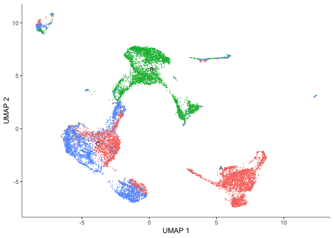<!-- -->

```r
plot_cells(cds,
           reduction_method = "UMAP",
           color_cells_by = "res.0.3",
           group_label_size = 3,
           show_trajectory_graph = FALSE)
```

<!-- -->

One thing we can observe here is that our Seurat clusters are a bit less contiguous that we might expect on our UMAP plot.

## TSNE

We can simply choose whichever is more easily interpreted and better helps us understand and tell the story of our experiment.


```r
cds <- reduce_dimension(cds,
                        preprocess_method = "PCA",
                        reduction_method="tSNE")
plot_cells(cds,
           reduction_method="tSNE",
           color_cells_by = "res.0.3",
           group_label_size = 3,
           show_trajectory_graph = FALSE)
```

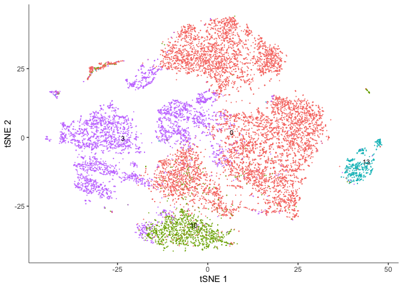<!-- -->

```r
plot_cells(cds,
           reduction_method="tSNE",
           color_cells_by = "orig.ident",
           group_label_size = 3,
           show_trajectory_graph = FALSE)
```

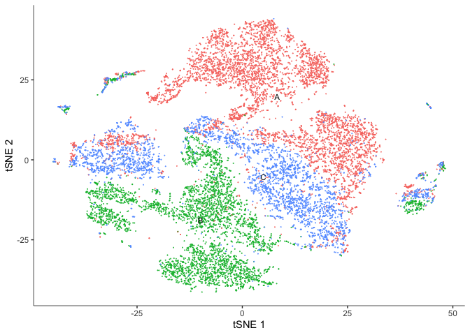<!-- -->

The Seurat clusters look a bit more contiguous when displayed on the tSNE plot. Use whichever you prefer for the remainder of the analysis.

# Clustering cells in monocle3

Monocle groups cells into clusters using community detection methods in the function `cluster_cells()`. Explore the options. Do they impact the number of clusters? The number of partitions?


```r
cds <- cluster_cells(cds, resolution=1e-5)
# Seurat clusters
plot_cells(cds,
           reduction_method = "UMAP",
           color_cells_by = "res.0.3",
           group_label_size = 3,
           show_trajectory_graph = FALSE)
```

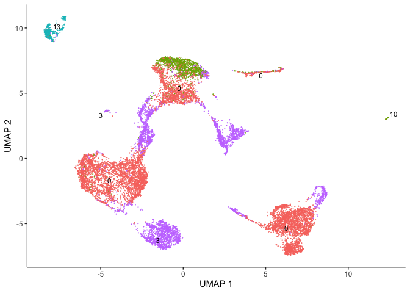<!-- -->

```r
# Monocle clusters
plot_cells(cds,
           reduction_method = "UMAP",
           color_cells_by = "cluster",
           group_label_size = 3,
           show_trajectory_graph = FALSE)
```

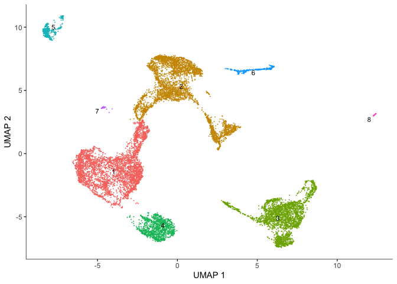<!-- -->

In addition to clusters, monocle produces partitions, which are larger well-separated groups.


```r
plot_cells(cds,
           reduction_method = "UMAP",
           color_cells_by = "partition",
           group_cells_by = "partition",
           group_label_size = 3,
           show_trajectory_graph = FALSE)
```

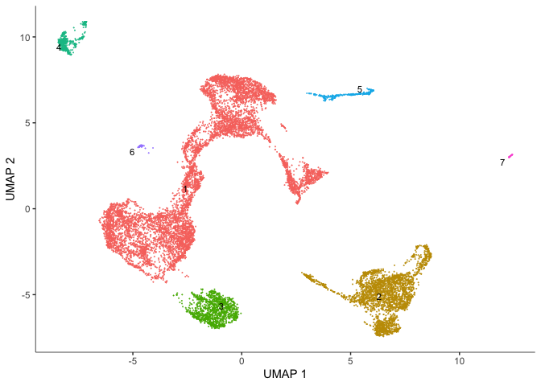<!-- -->

## Identify and plot marker genes for each cluster

Top markers identifies genes that are most specifically expressed in each group of cells. In this case, we are grouping cells by their monocle3 cluster. When `marker_sig_test = "TRUE"`, monocle3 will perform a significance test on the discriminative power of each marker. This may be slow, so we have dedicated several cores to help speed up the process. You may set this number depending on the specifications of your computer. The reference set for the significance test is randomly selected.


```r
marker_test_res <- top_markers(cds,
                               group_cells_by="cluster",
                               reduction_method = "UMAP",
                               marker_sig_test = TRUE,
                               reference_cells=1000,
                               cores=8)
```

Once monocle has identified markers, we can explore the results and take a look at the genes identified. For example, how many marker genes were identified? Are any of the genes markers for more than one cluster?


```r
head(marker_test_res)
```

<div class='r_output'>   gene_id gene_short_name cell_group marker_score mean_expression
 1  Ptpn18          Ptpn18          5    0.3265451       2.0742314
 2   Myo1b           Myo1b          7    0.4295049       0.7694042
 3    Cd28            Cd28          5    0.3637586       0.6442692
 4     Dbi             Dbi          2    0.1931075       2.4581656
 5   Ptprc           Ptprc          5    0.4334619       1.2359930
 6    Fmo2            Fmo2          4    0.4901488       2.4725707
   fraction_expressing specificity  pseudo_R2 marker_test_p_value
 1           0.9164969   0.3562970 0.32069915       5.817614e-113
 2           0.6486486   0.6621533 0.37257244        1.892527e-42
 3           0.4928717   0.7380391 0.27881605        3.309625e-98
 4           0.8985585   0.2149081 0.03909594        1.869199e-31
 5           0.7535642   0.5752157 0.42773728       5.114157e-151
 6           0.8233333   0.5953224 0.50166529       1.328965e-270
   marker_test_q_value
 1       6.312344e-108
 2        2.053468e-37
 3        3.591076e-93
 4        2.028155e-26
 5       5.549065e-146
 6       1.441980e-265
</div>

```r
dim(marker_test_res)
```

<div class='r_output'> [1] 200  10
</div>

```r
length(which(duplicated(marker_test_res$gene_id)))
```

<div class='r_output'> [1] 10
</div>

```r
duplicate_markers <- names(which(table(marker_test_res$gene_id) > 1))
head(marker_test_res[marker_test_res$gene_id %in% duplicate_markers,])
```

<div class='r_output'>
    gene_id gene_short_name cell_group marker_score mean_expression
 9   Fcgr2b          Fcgr2b          1    0.2167942        7.533416
 10  Fcgr2b          Fcgr2b          3    0.2765248       10.460721
 23    Bmp2            Bmp2          1    0.1955812        5.155748
 24    Bmp2            Bmp2          3    0.2484916        6.835971
 43   Plpp3           Plpp3          1    0.1998788        5.391522
 44   Plpp3           Plpp3          3    0.2779725        8.089170
    fraction_expressing specificity  pseudo_R2 marker_test_p_value
 9            0.9585125   0.2261778 0.07689404        2.133064e-61
 10           0.9538835   0.2898936 0.13826834       4.569750e-100
 23           0.8889451   0.2200150 0.04656970        9.951700e-38
 24           0.9126214   0.2722834 0.10343539        5.260618e-75
 43           0.9415634   0.2122839 0.04149975        8.753089e-34
 44           0.9635922   0.2884752 0.15237836       2.802370e-110
    marker_test_q_value
 9         2.314460e-56
 10        4.958361e-95
 23        1.079799e-32
 24        5.707981e-70
 43        9.497452e-29
 44       3.040684e-105
</div>

```r
unique_markers <- marker_test_res[!(marker_test_res$gene_id %in% duplicate_markers),]
head(unique_markers)
```

<div class='r_output'>   gene_id gene_short_name cell_group marker_score mean_expression
 1  Ptpn18          Ptpn18          5    0.3265451       2.0742314
 2   Myo1b           Myo1b          7    0.4295049       0.7694042
 3    Cd28            Cd28          5    0.3637586       0.6442692
 4     Dbi             Dbi          2    0.1931075       2.4581656
 5   Ptprc           Ptprc          5    0.4334619       1.2359930
 6    Fmo2            Fmo2          4    0.4901488       2.4725707
   fraction_expressing specificity  pseudo_R2 marker_test_p_value
 1           0.9164969   0.3562970 0.32069915       5.817614e-113
 2           0.6486486   0.6621533 0.37257244        1.892527e-42
 3           0.4928717   0.7380391 0.27881605        3.309625e-98
 4           0.8985585   0.2149081 0.03909594        1.869199e-31
 5           0.7535642   0.5752157 0.42773728       5.114157e-151
 6           0.8233333   0.5953224 0.50166529       1.328965e-270
   marker_test_q_value
 1       6.312344e-108
 2        2.053468e-37
 3        3.591076e-93
 4        2.028155e-26
 5       5.549065e-146
 6       1.441980e-265
</div>

```r
rm(marker_test_res, duplicate_markers)
```

There are too many markers to look at all at once. Let's limit the number of markers to display on a plot. The plot produced here displays expression level (color) and percentage of cells in which the marker is expressed for each cluster.


```r
top_specific_markers <- unique_markers %>%
  filter(fraction_expressing >= 0.10) %>%
  group_by(cell_group) %>%
  arrange(desc(specificity), .by_group = TRUE) %>%
  dplyr::slice(1:3) %>%
  pull(gene_id)

plot_genes_by_group(cds,
                    top_specific_markers,
                    group_cells_by="cluster",
                    ordering_type="cluster_row_col",
                    max.size=3)
```

<!-- -->

We can also plot the expression of a user-defined list of markers (or genes of interest).


```r
markers <- c("Ehd3", "Sdc1", "Fmo2", "Cd3g", "Ccna2", "Hbb-bt")
plot_cells(cds, genes = markers)
```

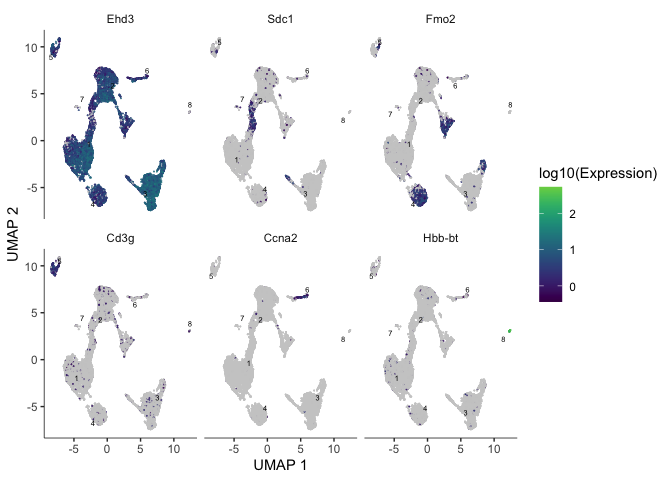<!-- -->

# Trajectory analysis

In a data set like this one, cells were not harvested in a time series, but may not have all been at the same developmental stage. Monocle offers trajectory analysis to model the relationships between groups of cells as a trajectory of gene expression changes. The first step in trajectory analysis is the `learn_graph()` function. This may be time consuming.


```r
cds <- learn_graph(cds, use_partition = TRUE, verbose = FALSE)
```

After learning the graph, monocle can plot add the trajectory graph to the cell plot.


```r
plot_cells(cds,
           color_cells_by = "cluster",
           label_groups_by_cluster=FALSE,
           label_leaves=FALSE,
           label_branch_points=FALSE)
```

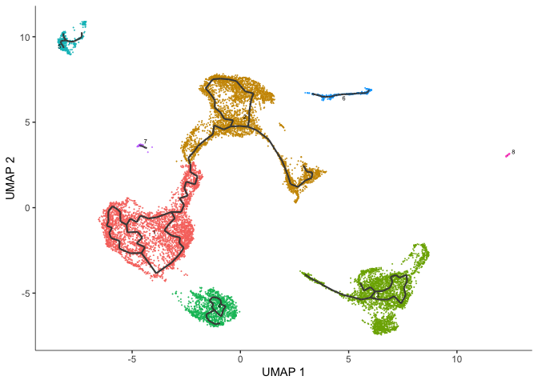<!-- -->

Not all of our trajectories are connected. In fact, only clusters that belong to the same partition are connected by a trajectory.

# Color cells by pseudotime

We can set the root to any one of our clusters by selecting the cells in that cluster to use as the root in the function `order_cells`. All cells that cannot be reached from a trajectory with our selected root will be gray, which represents "infinite" pseudotime.


```r
root5 <- order_cells(cds, root_cells = colnames(cds[,clusters(cds) == 5]))
plot_cells(root5,
           color_cells_by = "pseudotime",
           group_cells_by = "cluster",
           label_cell_groups = FALSE,
           label_groups_by_cluster=FALSE,
           label_leaves=FALSE,
           label_branch_points=FALSE,
           label_roots = FALSE,
           trajectory_graph_color = "grey60")
```

<!-- -->

Here the pseudotime trajectory is rooted in cluster 5. This choice was arbitrary. In reality, you would make the decision about where to root your trajectory based upon what you know about your experiment. If, for example, the markers identified with cluster 1 suggest to you that cluster 1 represents the earliest developmental time point, you would likely root your pseudotime trajectory there. Explore what the pseudotime analysis looks like with the root in different clusters. Because we have not set a seed for the random process of clustering, cluster numbers will differ between R sessions.

# Identify genes that change as a function of pseudotime

Monocle's `graph_test()` function detects genes that vary over a trajectory. This may run very slowly. Adjust the number of cores as needed.


```r
cds_graph_test_results <- graph_test(cds,
                                     neighbor_graph = "principal_graph",
                                     cores = 8)
```

The output of this function is a table. We can look at the expression of some of these genes overlaid on the trajectory plot.


```r
head(cds_graph_test_results)
deg_ids <- rownames(subset(cds_graph_test_results[order(cds_graph_test_results$morans_I, decreasing = TRUE),], q_value < 0.05))
plot_cells(cds,
           genes = head(deg_ids),
           show_trajectory_graph = FALSE,
           label_cell_groups = FALSE,
           label_leaves = FALSE)
```

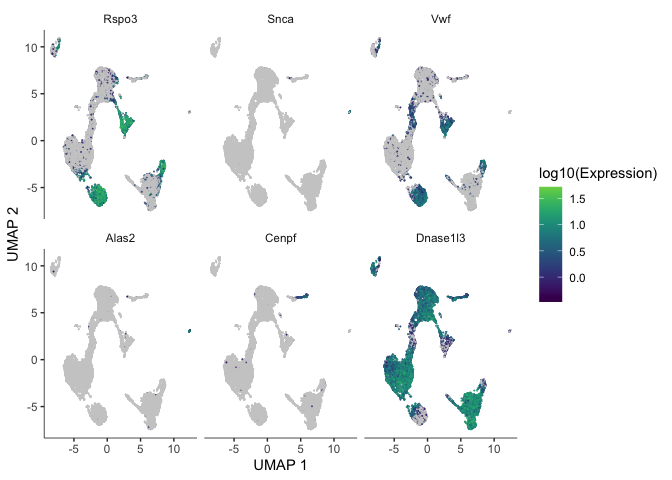<!-- -->

We can also calculate modules of co-expressed genes. By providing the module-finding function with a list of possible resolutions, we are telling Louvain to perform the clustering at each resolution and select the result with the greatest modularity. Modules will only be calculated for genes that vary as a function of pseudotime.

This heatmap displays the association of each gene module with each cell type.


```r
gene_modules <- find_gene_modules(cds[deg_ids,],
                                  resolution=c(10^seq(-6,-1)))
table(gene_modules$module)
```

<div class='r_output'>   1   2   3   4   5   6   7   8   9  10  11  12  13  14  15  16  17  18  19  20
 344 335 318 309 299 291 272 256 243 233 225 223 221 219 218 214 203 200 199 192
  21  22  23  24  25  26  27  28  29  30  31  32  33  34  35  36  37  38  39  40
 189 187 181 179 177 175 172 171 167 161 161 156 141 139 135 133 130 126 124 121
  41  42  43  44  45  46  47  48  49  50  51  52  53  54  55
 115 111 110 110 109  90  89  77  77  75  61  56  46  29  20
</div>

```r
cell_groups <- data.frame(cell = row.names(colData(cds)),
                             cell_group = colData(cds)$orig.ident)
agg_mat <- aggregate_gene_expression(cds,
                                     gene_group_df = gene_modules,
                                     cell_group_df = cell_groups)
dim(agg_mat)
```

<div class='r_output'> [1] 55  3
</div>

```r
row.names(agg_mat) <- paste0("Module ", row.names(agg_mat))
pheatmap::pheatmap(agg_mat,
                   scale="column",
                   treeheight_row = 0,
                   treeheight_col = 0,
                   clustering_method="ward.D2")
```

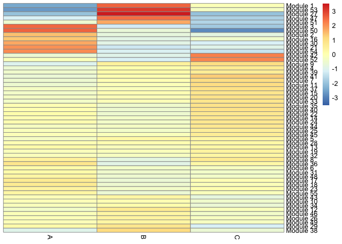<!-- -->
We can also display the relationship between gene modules and monocle clusters as a heatmap.


```r
cluster_groups <- data.frame(cell = row.names(colData(cds)),
                             cluster_group = cds@clusters$UMAP[[2]])
agg_mat2 <- aggregate_gene_expression(cds, gene_modules, cluster_groups)
dim(agg_mat2)
```

<div class='r_output'> [1] 55  7
</div>

```r
row.names(agg_mat2) <- paste0("Module ", row.names(agg_mat2))
pheatmap::pheatmap(agg_mat2,
                   scale="column",
                   treeheight_row = 0,
                   treeheight_col = 0,
                   clustering_method="ward.D2")
```

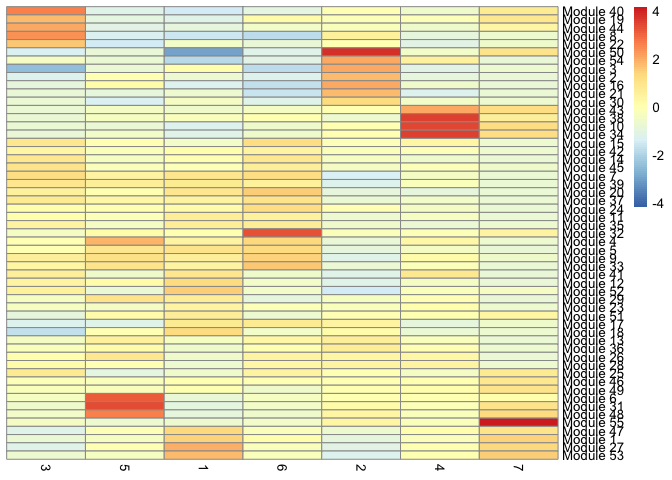<!-- -->


```r
gm <- gene_modules[which(gene_modules$module %in% c(6, 32)),]
plot_cells(cds,
           genes=gm,
           label_cell_groups=FALSE,
           show_trajectory_graph=TRUE,
           label_branch_points = FALSE,
           label_roots = FALSE,
           label_leaves = FALSE,
           trajectory_graph_color = "grey60")
```

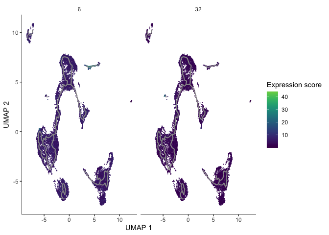<!-- -->

# R session information

```r
sessionInfo()
```

<div class='r_output'> R version 4.0.2 (2020-06-22)
 Platform: x86_64-apple-darwin17.0 (64-bit)
 Running under: macOS Catalina 10.15.6

 Matrix products: default
 BLAS:   /Library/Frameworks/R.framework/Versions/4.0/Resources/lib/libRblas.dylib
 LAPACK: /Library/Frameworks/R.framework/Versions/4.0/Resources/lib/libRlapack.dylib

 locale:
 [1] en_US.UTF-8/en_US.UTF-8/en_US.UTF-8/C/en_US.UTF-8/en_US.UTF-8

 attached base packages:
 [1] stats4    parallel  stats     graphics  grDevices utils     datasets
 [8] methods   base     

 other attached packages:
  [1] dplyr_1.0.1                 monocle3_0.2.1             
  [3] SingleCellExperiment_1.10.1 SummarizedExperiment_1.18.2
  [5] DelayedArray_0.14.1         matrixStats_0.56.0         
  [7] GenomicRanges_1.40.0        GenomeInfoDb_1.24.2        
  [9] IRanges_2.22.2              S4Vectors_0.26.1           
 [11] Biobase_2.48.0              BiocGenerics_0.34.0        

 loaded via a namespace (and not attached):
  [1] nlme_3.1-148              bitops_1.0-6             
  [3] sf_0.9-5                  gmodels_2.18.1           
  [5] RcppAnnoy_0.0.16          RColorBrewer_1.1-2       
  [7] tools_4.0.2               R6_2.4.1                 
  [9] irlba_2.3.3               KernSmooth_2.23-17       
 [11] spData_0.3.8              uwot_0.1.8               
 [13] DBI_1.1.0                 colorspace_1.4-1         
 [15] raster_3.3-13             sp_1.4-2                 
 [17] tidyselect_1.1.0          gridExtra_2.3            
 [19] compiler_4.0.2            expm_0.999-5             
 [21] labeling_0.3              slam_0.1-47              
 [23] scales_1.1.1              classInt_0.4-3           
 [25] proxy_0.4-24              stringr_1.4.0            
 [27] digest_0.6.25             rmarkdown_2.3            
 [29] XVector_0.28.0            RhpcBLASctl_0.20-137     
 [31] pkgconfig_2.0.3           htmltools_0.5.0          
 [33] rlang_0.4.7               DelayedMatrixStats_1.10.1
 [35] farver_2.0.3              generics_0.0.2           
 [37] gtools_3.8.2              spdep_1.1-5              
 [39] RCurl_1.98-1.2            magrittr_1.5             
 [41] GenomeInfoDbData_1.2.3    Matrix_1.2-18            
 [43] Rcpp_1.0.5                munsell_0.5.0            
 [45] viridis_0.5.1             lifecycle_0.2.0          
 [47] stringi_1.4.6             yaml_2.2.1               
 [49] MASS_7.3-51.6             zlibbioc_1.34.0          
 [51] Rtsne_0.15                plyr_1.8.6               
 [53] grid_4.0.2                gdata_2.18.0             
 [55] ggrepel_0.8.2             crayon_1.3.4             
 [57] deldir_0.1-28             lattice_0.20-41          
 [59] splines_4.0.2             knitr_1.29               
 [61] pillar_1.4.6              igraph_1.2.5             
 [63] boot_1.3-25               reshape2_1.4.4           
 [65] codetools_0.2-16          LearnBayes_2.15.1        
 [67] glue_1.4.1                evaluate_0.14            
 [69] leidenbase_0.1.0          vctrs_0.3.2              
 [71] gtable_0.3.0              grr_0.9.5                
 [73] RANN_2.6.1                purrr_0.3.4              
 [75] tidyr_1.1.1               assertthat_0.2.1         
 [77] ggplot2_3.3.2             xfun_0.16                
 [79] e1071_1.7-3               RSpectra_0.16-0          
 [81] coda_0.19-3               class_7.3-17             
 [83] viridisLite_0.3.0         tibble_3.0.3             
 [85] pheatmap_1.0.12           pbmcapply_1.5.0          
 [87] Matrix.utils_0.9.8        units_0.6-7              
 [89] ellipsis_0.3.1
</div>
