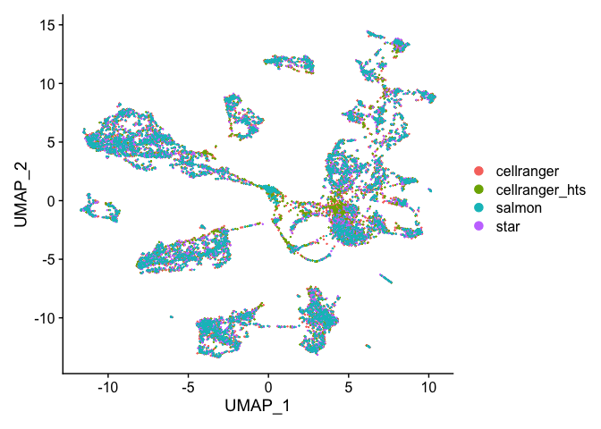
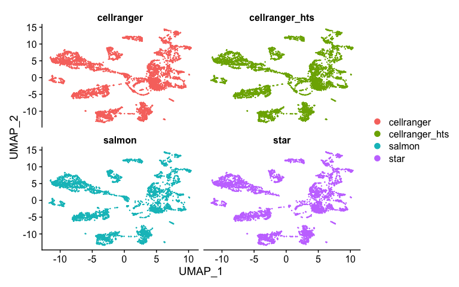
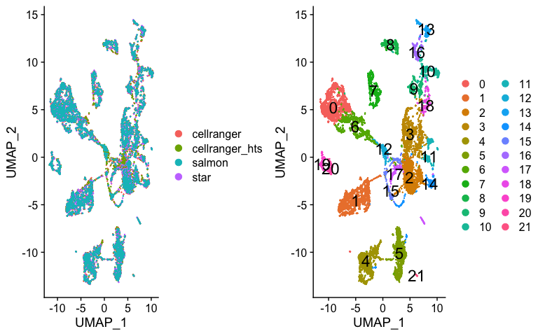
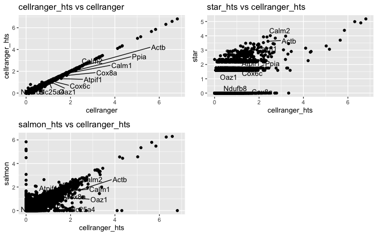

In this section, we will learn how to take two separate datasets and "integrate" them, so that cells of the same type (across datasets) roughly fall into the same region of the tsne or umap plot (instead of separating by dataset first).

Integration is typically done in a few different scenarios, e.g.,

* if you collect data from across multiple conditions/days/batches/experiments/etc. and you want to remove these technical confounders.
* if you are doing a case/control study and you want to identify which cells match across condition.
* you have performed an experiment sequencing cells from a tissue (e.g. lung epithelium) and you want to label the cells by cell type, but you don't have marker genes available, however, you do have access to a database of annotated cells that you could map onto your dataset (example a cell atlas).


## We start with loading needed libraries for R

```r
library(Seurat)
library(tximport)
library(ggplot2)
library(ggVennDiagram)
library(cowplot)
```


## Lets read the data back in and create a list of each dataset rather than merge like we did in Mapping_Comparisons

```r
## Cellranger
cellranger_orig <- Read10X_h5("Adv_comparison_outputs/654/outs/filtered_feature_bc_matrix.h5")
# If hdf5 isn't working read in from the mtx files
#cellranger_orig <- Read10X("Adv_comparison_outputs/654/outs/filtered_feature_bc_matrix")
s_cellranger_orig <- CreateSeuratObject(counts = cellranger_orig, min.cells = 3, min.features = 200, project = "cellranger")
s_cellranger_orig
```

```
## An object of class Seurat 
## 15256 features across 4939 samples within 1 assay 
## Active assay: RNA (15256 features, 0 variable features)
```

```r
cellranger_htstream <- Read10X_h5("Adv_comparison_outputs/654_htstream/outs/filtered_feature_bc_matrix.h5")
s_cellranger_hts <- CreateSeuratObject(counts = cellranger_htstream, min.cells = 3, min.features = 200, project = "cellranger_hts")
s_cellranger_hts
```

```
## An object of class Seurat 
## 15252 features across 4933 samples within 1 assay 
## Active assay: RNA (15252 features, 0 variable features)
```

```r
## STAR
star <- Read10X("Adv_comparison_outputs/654_htstream_star/outs/filtered_feature_bc_matrix")
s_star_hts <- CreateSeuratObject(counts = star, min.cells = 3, min.features = 200, project = "star")
s_star_hts
```

```
## An object of class Seurat 
## 15118 features across 4099 samples within 1 assay 
## Active assay: RNA (15118 features, 0 variable features)
```

```r
## SALMON
txi <- tximport("Adv_comparison_outputs/654_htstream_salmon_decoys/alevin/quants_mat.gz", type="alevin")
```

```
## importing alevin data is much faster after installing `fishpond` (>= 1.2.0)
```

```
## reading in alevin gene-level counts across cells
```

```r
## salmon is in ensembl IDs, need to convert to gene symbol
head(rownames(txi$counts))
```

```
## [1] "ENSMUSG00000064370.1" "ENSMUSG00000064368.1" "ENSMUSG00000064367.1"
## [4] "ENSMUSG00000064363.1" "ENSMUSG00000065947.3" "ENSMUSG00000064360.1"
```

```r
ens2symbol <- read.table("ens2sym.txt",sep="\t",header=T,as.is=T)
map <- ens2symbol$Gene.name[match(rownames(txi$counts),ens2symbol$Gene.stable.ID.version)]

txi_counts <- txi$counts[-which(duplicated(map)),]
map <- map[-which(duplicated(map))]
rownames(txi_counts) <- map
dim(txi_counts)
```

```
## [1] 35805  3919
```

```r
s_salmon_hts <- CreateSeuratObject(counts = txi_counts , min.cells = 3, min.features = 200, project = "salmon")
s_salmon_hts
```

```
## An object of class Seurat 
## 15630 features across 3918 samples within 1 assay 
## Active assay: RNA (15630 features, 0 variable features)
```

```r
# Need to Check Col names before merge

# they however have different looking cell ids, need to fix
head(colnames(s_cellranger_orig))
```

```
## [1] "AAACCTGAGATCACGG-1" "AAACCTGAGCATCATC-1" "AAACCTGAGCGCTCCA-1"
## [4] "AAACCTGAGTGGGATC-1" "AAACCTGCAGACAGGT-1" "AAACCTGCATCATCCC-1"
```

```r
head(colnames(s_star_hts))
```

```
## [1] "AAACCTGAGATCACGG" "AAACCTGAGCATCATC" "AAACCTGAGCGCTCCA" "AAACCTGAGTGGGATC"
## [5] "AAACCTGCAGACAGGT" "AAACCTGGTATAGGTA"
```

```r
head(colnames(s_salmon_hts))
```

```
## [1] "TGGGAAGCACTACAGT" "CACATAGAGACTAGGC" "GTTTCTAGTTCCACAA" "TACTCATCATAGGATA"
## [5] "CACAGGCCAATCTGCA" "GTAGGCCAGGACAGCT"
```

```r
s_cellranger_orig <- RenameCells(s_cellranger_orig, new.names = sapply(X = strsplit(colnames(s_cellranger_orig), split = "-"), FUN = "[", 1))

s_cellranger_hts <- RenameCells(s_cellranger_hts, new.names = sapply(X = strsplit(colnames(s_cellranger_hts), split = "-"), FUN = "[", 1))
```

Instead of merging the datasets (column binding the cells). This time we are going to make an R list

```r
s_list = list(s_cellranger_orig, s_cellranger_hts, s_star_hts, s_salmon_hts)
```


## using the Standare Seurat technique

### Normalization and Variable Features
Before we identify integration sites and find anchors, First perform normalization and identify variable features for each


```r
s_standard = s_list
for (i in 1:length(s_standard)) {
    s_standard[[i]] <- NormalizeData(s_standard[[i]], verbose = FALSE)
    s_standard[[i]] <- FindVariableFeatures(s_standard[[i]], selection.method = "vst", nfeatures = 2000, verbose = FALSE)
}
```

### Identify "anchors"

Next, we identify anchors using the FindIntegrationAnchors function, which takes a list of Seurat objects as input.

* Representation of two datasets, reference and query, each of which originates from a separate single-cell experiment. The two datasets share cells from similar biological states.
* Seurat perform canonical correlation analysis, followed by L2 normalization of the canonical correlation vectors, to project the datasets into a subspace defined by shared correlation structure across datasets.
* In the shared space, Seurat identify pairs of MNNs across reference and query cells. These should represent cells in a shared biological state across datasets and serve as anchors to guide dataset integration. In principle, cells in unique populations should not participate in anchors, but in practice, there will be ‘incorrect’ anchors hopefully at low frequency.
* For each anchor pair, Seurat assigns a score based on the consistency of anchors across the neighborhood structure of each dataset.
* The utilizes anchors and their scores to compute ‘correction’ vectors for each query cell, transforming its expression so it can be jointly analyzed as part of an integrated reference.


```r
?FindIntegrationAnchors
```

We use all default parameters here for identifying anchors, including the ‘dimensionality’ of the dataset (30)


```r
s.anchors_standard <- FindIntegrationAnchors(object.list = s_standard, dims = 1:30)
```

```
## Warning in CheckDuplicateCellNames(object.list = object.list): Some cell names
## are duplicated across objects provided. Renaming to enforce unique cell names.
```

```
## Computing 2000 integration features
```

```
## Scaling features for provided objects
```

```
## Finding all pairwise anchors
```

```
## Running CCA
```

```
## Merging objects
```

```
## Finding neighborhoods
```

```
## Finding anchors
```

```
## 	Found 13785 anchors
```

```
## Filtering anchors
```

```
## 	Retained 10699 anchors
```

```
## Running CCA
```

```
## Merging objects
```

```
## Finding neighborhoods
```

```
## Finding anchors
```

```
## 	Found 12369 anchors
```

```
## Filtering anchors
```

```
## 	Retained 9806 anchors
```

```
## Running CCA
```

```
## Merging objects
```

```
## Finding neighborhoods
```

```
## Finding anchors
```

```
## 	Found 12350 anchors
```

```
## Filtering anchors
```

```
## 	Retained 9746 anchors
```

```
## Running CCA
```

```
## Merging objects
```

```
## Finding neighborhoods
```

```
## Finding anchors
```

```
## 	Found 11843 anchors
```

```
## Filtering anchors
```

```
## 	Retained 9526 anchors
```

```
## Running CCA
```

```
## Merging objects
```

```
## Finding neighborhoods
```

```
## Finding anchors
```

```
## 	Found 11848 anchors
```

```
## Filtering anchors
```

```
## 	Retained 9554 anchors
```

```
## Running CCA
```

```
## Merging objects
```

```
## Finding neighborhoods
```

```
## Finding anchors
```

```
## 	Found 11608 anchors
```

```
## Filtering anchors
```

```
## 	Retained 9062 anchors
```

```r
s.integrated_standard <- IntegrateData(anchorset = s.anchors_standard, dims = 1:30)
```

```
## Merging dataset 4 into 2
```

```
## Extracting anchors for merged samples
```

```
## Finding integration vectors
```

```
## Finding integration vector weights
```

```
## Integrating data
```

```
## Merging dataset 3 into 1
```

```
## Extracting anchors for merged samples
```

```
## Finding integration vectors
```

```
## Finding integration vector weights
```

```
## Integrating data
```

```
## Merging dataset 2 4 into 1 3
```

```
## Extracting anchors for merged samples
```

```
## Finding integration vectors
```

```
## Finding integration vector weights
```

```
## Integrating data
```

```
## Warning: Adding a command log without an assay associated with it
```


### The returned object

will contain a new Assay, which holds an integrated (or ‘batch-corrected’) expression matrix for all cells, enabling them to be jointly analyzed.


```r
s.integrated_standard
```

```
## An object of class Seurat 
## 19218 features across 17889 samples within 2 assays 
## Active assay: integrated (2000 features, 2000 variable features)
##  1 other assay present: RNA
```

```r
DefaultAssay(object = s.integrated_standard) <- "RNA"
s.integrated_standard
```

```
## An object of class Seurat 
## 19218 features across 17889 samples within 2 assays 
## Active assay: RNA (17218 features, 0 variable features)
##  1 other assay present: integrated
```

```r
DefaultAssay(object = s.integrated_standard) <- "integrated"
s.integrated_standard
```

```
## An object of class Seurat 
## 19218 features across 17889 samples within 2 assays 
## Active assay: integrated (2000 features, 2000 variable features)
##  1 other assay present: RNA
```


### Now visualize after anchoring and integration

# Run the standard workflow for visualization and clustering


```r
s.integrated_standard <- ScaleData(s.integrated_standard, verbose = FALSE)
s.integrated_standard <- RunPCA(s.integrated_standard, npcs = 30, verbose = FALSE)
s.integrated_standard <- RunUMAP(s.integrated_standard, reduction = "pca", dims = 1:30)
```

```
## Warning: The default method for RunUMAP has changed from calling Python UMAP via reticulate to the R-native UWOT using the cosine metric
## To use Python UMAP via reticulate, set umap.method to 'umap-learn' and metric to 'correlation'
## This message will be shown once per session
```

```
## 08:41:18 UMAP embedding parameters a = 0.9922 b = 1.112
```

```
## 08:41:18 Read 17889 rows and found 30 numeric columns
```

```
## 08:41:18 Using Annoy for neighbor search, n_neighbors = 30
```

```
## 08:41:18 Building Annoy index with metric = cosine, n_trees = 50
```

```
## 0%   10   20   30   40   50   60   70   80   90   100%
```

```
## [----|----|----|----|----|----|----|----|----|----|
```

```
## **************************************************|
## 08:41:21 Writing NN index file to temp file /var/folders/74/h45z17f14l9g34tmffgq9nkw0000gn/T//Rtmpe0LFoY/file2bba5dcd1fc1
## 08:41:21 Searching Annoy index using 1 thread, search_k = 3000
## 08:41:26 Annoy recall = 100%
## 08:41:26 Commencing smooth kNN distance calibration using 1 thread
## 08:41:27 Initializing from normalized Laplacian + noise
## 08:41:29 Commencing optimization for 200 epochs, with 797120 positive edges
## 08:41:37 Optimization finished
```

```r
DimPlot(s.integrated_standard, reduction = "umap")
```

<!-- -->


### Excersise

Check the help of FindIntegrationAnchors. What happens when you change dims (try varying this parameter over a broad range, for example between 10 and 50), k.anchor, k.filter and k.score?

|-------|-------|
|:------|:------|
|dims | Which dimensions to use from the CCA to specify the neighbor search space |
|k.anchor	| How many neighbors (k) to use when picking anchors |
| k.filter	| How many neighbors (k) to use when filtering anchors |
| k.score	| How many neighbors (k) to use when scoring anchors |

Example
```
s.anchors_standard <- FindIntegrationAnchors(object.list = s_standard, dims = 1:2)
```

### Now lets look closer

Splitting by prepocessing type

```r
DimPlot(s.integrated_standard, reduction = "umap", split.by = "orig.ident", ncol=2)
```

<!-- -->

### We can conduct more analysis, perform clustering

```r
s.integrated_standard <- FindNeighbors(s.integrated_standard, reduction = "pca", dims = 1:30)
```

```
## Computing nearest neighbor graph
```

```
## Computing SNN
```

```r
s.integrated_standard <- FindClusters(s.integrated_standard, resolution = 0.5)
```

```
## Modularity Optimizer version 1.3.0 by Ludo Waltman and Nees Jan van Eck
## 
## Number of nodes: 17889
## Number of edges: 764274
## 
## Running Louvain algorithm...
## Maximum modularity in 10 random starts: 0.9456
## Number of communities: 22
## Elapsed time: 1 seconds
```

```r
p1 <- DimPlot(s.integrated_standard, reduction = "umap", group.by = "orig.ident")
p2 <- DimPlot(s.integrated_standard, reduction = "umap", label = TRUE, label.size = 6)
```

```
## Warning: Using `as.character()` on a quosure is deprecated as of rlang 0.3.0.
## Please use `as_label()` or `as_name()` instead.
## This warning is displayed once per session.
```

```r
plot_grid(p1, p2)
```

<!-- -->

## Now lets look at cluster representation per dataset

```r
t <- table(s.integrated_standard$integrated_snn_res.0.5, s.integrated_standard$orig.ident)
t
```

```
##     
##      cellranger cellranger_hts salmon star
##   0         556            553    551  552
##   1         548            548    479  506
##   2         643            636    317  415
##   3         446            446    364  396
##   4         425            425    377  396
##   5         404            403    346  368
##   6         317            322    263  278
##   7         196            196    180  183
##   8         141            142    119  130
##   9         137            137    119  130
##   10        141            136     84  100
##   11        110            113     85   95
##   12        137            134    125    2
##   13        108            108     84   94
##   14        104            107     75   82
##   15        140            136     38   33
##   16         83             85     79   83
##   17        106            107     52   65
##   18         75             77     67   73
##   19         57             57     54   56
##   20         54             54     50   51
##   21         11             11     10   11
```

```r
round(sweep(t,MARGIN=2, STATS=colSums(t), FUN = "/")*100,1)
```

```
##     
##      cellranger cellranger_hts salmon star
##   0        11.3           11.2   14.1 13.5
##   1        11.1           11.1   12.2 12.3
##   2        13.0           12.9    8.1 10.1
##   3         9.0            9.0    9.3  9.7
##   4         8.6            8.6    9.6  9.7
##   5         8.2            8.2    8.8  9.0
##   6         6.4            6.5    6.7  6.8
##   7         4.0            4.0    4.6  4.5
##   8         2.9            2.9    3.0  3.2
##   9         2.8            2.8    3.0  3.2
##   10        2.9            2.8    2.1  2.4
##   11        2.2            2.3    2.2  2.3
##   12        2.8            2.7    3.2  0.0
##   13        2.2            2.2    2.1  2.3
##   14        2.1            2.2    1.9  2.0
##   15        2.8            2.8    1.0  0.8
##   16        1.7            1.7    2.0  2.0
##   17        2.1            2.2    1.3  1.6
##   18        1.5            1.6    1.7  1.8
##   19        1.2            1.2    1.4  1.4
##   20        1.1            1.1    1.3  1.2
##   21        0.2            0.2    0.3  0.3
```
### Lets Zero in on cluster 12 some more


```r
markers = FindMarkers(s.integrated_standard, ident.1="12")
top10 <- rownames(markers)[1:10]
head(markers)
```

```
##                 p_val avg_logFC pct.1 pct.2     p_val_adj
## Calm1   1.165630e-197 -1.977439 0.440 0.983 2.331261e-194
## Slc25a4 1.831204e-178 -1.907351 0.452 0.952 3.662408e-175
## Cox8a   7.071522e-171 -1.672094 0.462 0.970 1.414304e-167
## Ppia    1.063330e-168 -1.789062 0.653 0.979 2.126661e-165
## Oaz1    3.671981e-161 -1.683867 0.513 0.945 7.343963e-158
## Calm2   8.882593e-161 -1.498434 0.555 0.990 1.776519e-157
```

```r
cluster12 <- subset(s.integrated_standard, idents = "12")
Idents(cluster12) <- "orig.ident"
avg.cell.exp <- log1p(AverageExpression(cluster12, verbose = FALSE)$RNA)
avg.cell.exp$gene <- rownames(avg.cell.exp)

head(avg.cell.exp)
```

```
##        cellranger cellranger_hts     star    salmon   gene
## Xkr4   0.00000000     0.00000000 0.000000 0.0000000   Xkr4
## Sox17  0.12812093     0.12922176 0.000000 0.1835802  Sox17
## Mrpl15 0.00000000     0.00000000 0.000000 0.0000000 Mrpl15
## Lypla1 0.45449855     0.46387699 1.589267 0.5199105 Lypla1
## Tcea1  0.08880363     0.09048414 0.000000 0.3897373  Tcea1
## Rgs20  0.00000000     0.00000000 0.000000 0.0000000  Rgs20
```

```r
p1 <- ggplot(avg.cell.exp, aes(cellranger, cellranger_hts)) + geom_point() + ggtitle("cellranger_hts vs cellranger")
p1 <- LabelPoints(plot = p1, points = top10, repel = TRUE)
```

```
## When using repel, set xnudge and ynudge to 0 for optimal results
```

```r
p2 <- ggplot(avg.cell.exp, aes(cellranger_hts, star)) + geom_point() + ggtitle("star_hts vs cellranger_hts")
p2 <- LabelPoints(plot = p2, points = top10, repel = TRUE)
```

```
## When using repel, set xnudge and ynudge to 0 for optimal results
```

```r
p3 <- ggplot(avg.cell.exp, aes(cellranger_hts, salmon)) + geom_point() + ggtitle("salmon_hts vs cellranger_hts")
p3 <- LabelPoints(plot = p3, points = top10, repel = TRUE)
```

```
## When using repel, set xnudge and ynudge to 0 for optimal results
```

```r
plot_grid(p1,p2,p3, ncol = 2)
```

<!-- -->

### Possible continued analysis

We know the majority of 'cells' are in common between the datasets, so how is the cell barcode representation in each cluster. So for this cluster 12, what is the overlap in cells for cellranger/salmon/star if those cells are present in star, where did they go? Which cluster can they be found in.

**How I would go about doing this**
Get the superset of cell barcode from all 4 methods for cluster 12. Then extract these cells from the whole dataset (subset) and table the occurace of this subset of cells [superset of those found in 12], sample by cluster like we did above.

**ALSO**

Salmon had a few 'unique' cells, where did these go?


### More reading

For a larger list of alignment methods, as well as an evaluation of them, see Gerald Quons paper, ["scAlign: a tool for alignment, integration, and rare cell identification from scRNA-seq data"](https://genomebiology.biomedcentral.com/articles/10.1186/s13059-019-1766-4)


## Using SCTransform (Not Evaluated because it takes **a really long time**)


```r
s_sct <- s_list
for (i in 1:length(s_sct)) {
    s_sct[[i]] <- SCTransform(s_sct[[i]], verbose = FALSE)
}
```


```r
s_features_sct <- SelectIntegrationFeatures(object.list = s_sct, nfeatures = 2000)

s_sct <- PrepSCTIntegration(object.list = s_sct, anchor.features = s_features_sct, 
    verbose = FALSE)
```

### Identify anchors and integrate the datasets.

Commands are identical to the standard workflow, but make sure to set normalization.method = 'SCT':


```r
s_anchors_sct <- FindIntegrationAnchors(object.list = s_sct, normalization.method = "SCT",  anchor.features = s_features, verbose = FALSE)
s_integrated_sct <- IntegrateData(anchorset = s_anchors_sct, normalization.method = "SCT", verbose = FALSE)
```

### Now visualize after anchoring and integration

However, do not sun ScaleData, SCTransform does this step

```r
s.integrated_sct <- RunPCA(s.integrated_sct, npcs = 30, verbose = FALSE)
s.integrated_sct <- RunUMAP(s.integrated_sct, reduction = "pca", dims = 1:30)
DimPlot(s.integrated_sct, reduction = "umap")
```

**Rest is the same**

### More reading on SCTransform

[Normalization and variance stabilization of single-cell RNA-seq data using
regularized negative binomial regression](https://www.biorxiv.org/content/10.1101/576827v2)


## Finally, save the original object, write out a tab-delimited table that could be read into excel, and view the object.

```r
## anchored dataset in Seurat class
save(s.integrated_standard,file="anchored_object.RData")
```

## Also we will save a RDS file for usage in the shiny app as well:

```r
saveRDS(s.integrated_standard, file = "anchoring.rds")
```

## Session Information

```r
sessionInfo()
```

```
## R version 4.0.2 (2020-06-22)
## Platform: x86_64-apple-darwin17.0 (64-bit)
## Running under: macOS Catalina 10.15.5
## 
## Matrix products: default
## BLAS:   /Library/Frameworks/R.framework/Versions/4.0/Resources/lib/libRblas.dylib
## LAPACK: /Library/Frameworks/R.framework/Versions/4.0/Resources/lib/libRlapack.dylib
## 
## locale:
## [1] en_US.UTF-8/en_US.UTF-8/en_US.UTF-8/C/en_US.UTF-8/en_US.UTF-8
## 
## attached base packages:
## [1] stats     graphics  grDevices datasets  utils     methods   base     
## 
## other attached packages:
## [1] cowplot_1.0.0     ggVennDiagram_0.3 ggplot2_3.3.2     tximport_1.16.1  
## [5] Seurat_3.2.0     
## 
## loaded via a namespace (and not attached):
##   [1] Rtsne_0.15            colorspace_1.4-1      deldir_0.1-28        
##   [4] ellipsis_0.3.1        class_7.3-17          ggridges_0.5.2       
##   [7] futile.logger_1.4.3   spatstat.data_1.4-3   farver_2.0.3         
##  [10] leiden_0.3.3          listenv_0.8.0         bit64_4.0.2          
##  [13] ggrepel_0.8.2         RSpectra_0.16-0       codetools_0.2-16     
##  [16] splines_4.0.2         knitr_1.29            polyclip_1.10-0      
##  [19] jsonlite_1.7.0        ica_1.0-2             cluster_2.1.0        
##  [22] png_0.1-7             uwot_0.1.8            shiny_1.5.0          
##  [25] sctransform_0.2.1     compiler_4.0.2        httr_1.4.2           
##  [28] Matrix_1.2-18         fastmap_1.0.1         lazyeval_0.2.2       
##  [31] limma_3.44.3          later_1.1.0.1         formatR_1.7          
##  [34] htmltools_0.5.0       tools_4.0.2           rsvd_1.0.3           
##  [37] igraph_1.2.5          gtable_0.3.0          glue_1.4.1           
##  [40] RANN_2.6.1            reshape2_1.4.4        dplyr_1.0.2          
##  [43] Rcpp_1.0.5            spatstat_1.64-1       vctrs_0.3.2          
##  [46] ape_5.4-1             nlme_3.1-148          lmtest_0.9-37        
##  [49] xfun_0.16             stringr_1.4.0         globals_0.12.5       
##  [52] mime_0.9              miniUI_0.1.1.1        lifecycle_0.2.0      
##  [55] irlba_2.3.3           renv_0.11.0           goftest_1.2-2        
##  [58] future_1.18.0         MASS_7.3-51.6         zoo_1.8-8            
##  [61] scales_1.1.1          promises_1.1.1        spatstat.utils_1.17-0
##  [64] parallel_4.0.2        lambda.r_1.2.4        RColorBrewer_1.1-2   
##  [67] yaml_2.2.1            reticulate_1.16       pbapply_1.4-3        
##  [70] gridExtra_2.3         rpart_4.1-15          stringi_1.4.6        
##  [73] e1071_1.7-3           rlang_0.4.7           pkgconfig_2.0.3      
##  [76] evaluate_0.14         lattice_0.20-41       ROCR_1.0-11          
##  [79] purrr_0.3.4           tensor_1.5            sf_0.9-5             
##  [82] labeling_0.3          patchwork_1.0.1       htmlwidgets_1.5.1    
##  [85] bit_4.0.4             tidyselect_1.1.0      RcppAnnoy_0.0.16     
##  [88] plyr_1.8.6            magrittr_1.5          R6_2.4.1             
##  [91] generics_0.0.2        DBI_1.1.0             pillar_1.4.6         
##  [94] withr_2.2.0           mgcv_1.8-31           fitdistrplus_1.1-1   
##  [97] units_0.6-7           survival_3.2-3        abind_1.4-5          
## [100] tibble_3.0.3          future.apply_1.6.0    crayon_1.3.4         
## [103] hdf5r_1.3.3           futile.options_1.0.1  KernSmooth_2.23-17   
## [106] plotly_4.9.2.1        rmarkdown_2.3         grid_4.0.2           
## [109] data.table_1.13.0     digest_0.6.25         classInt_0.4-3       
## [112] xtable_1.8-4          VennDiagram_1.6.20    tidyr_1.1.1          
## [115] httpuv_1.5.4          munsell_0.5.0         viridisLite_0.3.0
```
